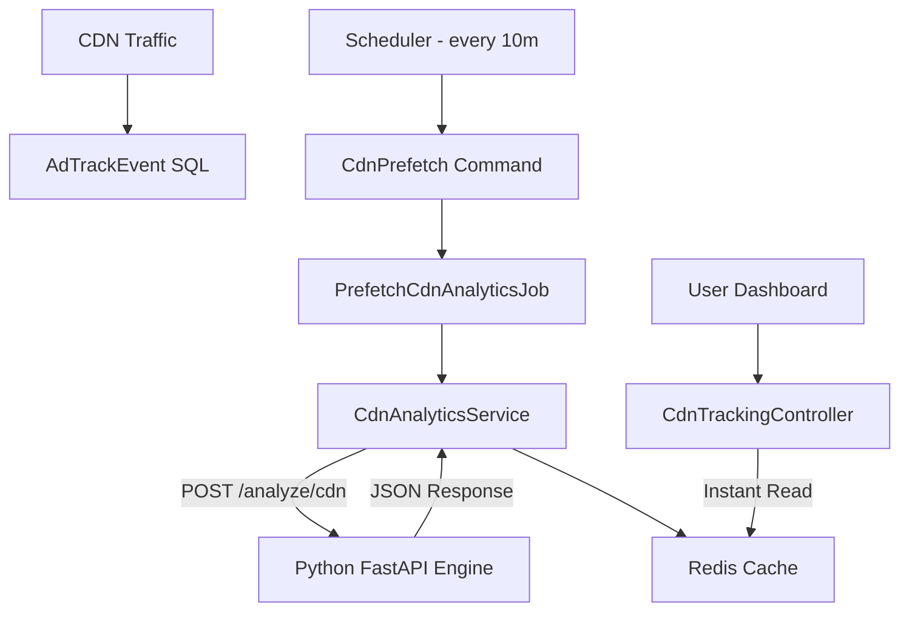

# CDN Analytics & Path Intelligence Deployment Guide

This document outlines the deployment and maintenance of the decoupled CDN analytics architecture, featuring the **Python Analytics Engine** and the **Laravel Prefetch Pipeline**.

## 1. Architecture Overview

The system is split into two specialized layers:
- **Data Layer (Laravel)**: Responsible for raw SQL aggregation and queue management.
- **Intelligence Layer (Python/FastAPI)**: Responsible for Path Intelligence (URL normalization), engagement scoring, and vectorized data processing using Pandas.



---

## 2. Python Analytics Engine Setup

The engine must be running on the internal network (typically port 8001).

### Prerequisites
- Python 3.10+
- `pip`, `virtualenv`

### Installation
```bash
cd /path/to/analytics-engine
virtualenv venv
source venv/bin/activate
pip install -r requirements.txt
```

### Production Execution (via Supervisor)
We recommend using **Supervisor** to ensure the engine stays alive. 
Create `/etc/supervisor/conf.d/cdn-engine.conf`:

```ini
[program:cdn-analytics-engine]
directory=/path/to/analytics-engine
command=/path/to/analytics-engine/venv/bin/uvicorn main:app --host 127.0.0.1 --port 8001
user=www-data
autostart=true
autorestart=true
stderr_logfile=/var/log/cdn-engine.err.log
stdout_logfile=/var/log/cdn-engine.out.log
```

---

## 3. Laravel Configuration

### Environment Variables (.env)
Ensure Laravel knows where to find the Python microservice:

```env
# URL of the Python FastAPI service
PYTHON_ENGINE_URL=http://127.0.0.1:8001
```

### Deployment Commands
After code updates, ensure the scheduler and workers are refreshed:

```bash
php artisan config:cache
php artisan queue:restart
```

---

## 4. Background Processes

### Scheduler
The **Path Intelligence** engine relies on pre-warmed data. Ensure the Laravel scheduler is running in your crontab:
`* * * * * cd /path/to/laravel && php artisan schedule:run >> /dev/null 2>&1`

The following command is automatically triggered every 10 minutes:
- `cdn:prefetch`: Identifies organizations with active pixels and dispatches pre-warm jobs.

### Queue Worker
The prefetch jobs run on the `default` queue. Ensure you have workers active:
`php artisan queue:work --timeout=120`

---

## 5. Monitoring & Verification

### Health Check Endpoints
- **Python Internal**: `GET http://127.0.0.1:8001/health/cdn`
- **Laravel Integrated**: `php artisan cdn:status` (Shows throughput and ingestion health)

### Troubleshooting
If the dashboard shows "Analytics engine is busy":
1. Check Python logs: `tail -f /path/to/analytics-engine/uvicorn.log`
2. Check Laravel error logs: `tail -f storage/logs/laravel.log`
3. Verify Redis connectivity: `php artisan redis:status`

---

## 6. Path Intelligence Rules
The engine automatically canonicalizes URLs by:
1. Stripping `utm_`, `gclid`, `fbclid`, and 30+ other tracking params.
2. Standardizing trailing slashes and lowercasing hosts.
3. (Optional) Collapsing numeric/UUID IDs into `{id}` placeholders if `normalize_ids` is passed from the UI.
